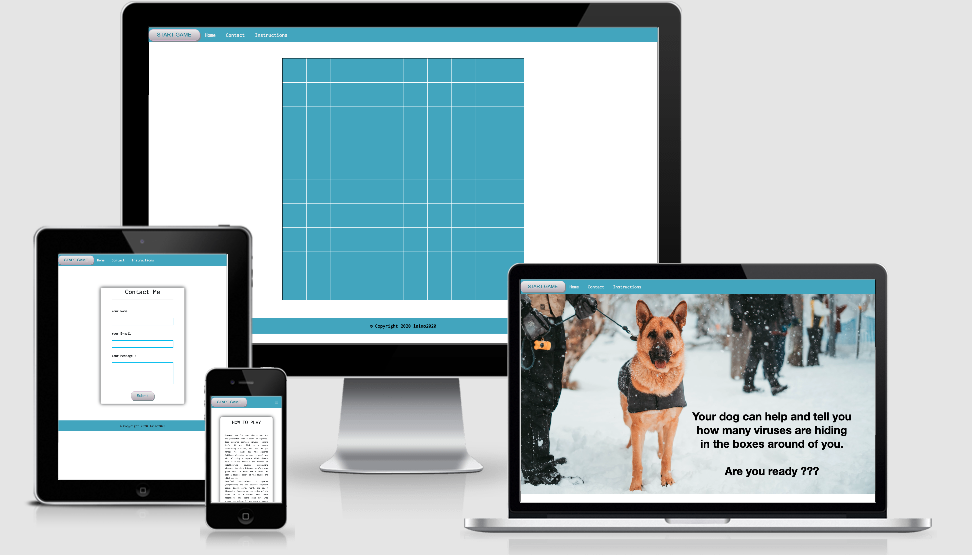

# Milestone Project 2: Corona Hunter 

This project includes “Corona-Hunter-” a game related to the ongoing Corona crisis in the world. It's based on Minesweeper game and gives the players opportunity to find and kill viruses in two levels with different grades of dificulties. Beside the game the page includes an introductory video, to raise the players attention and creates a story motivating the players to play the game. The game url is https://laimo2020.github.io/Corona-Hunter-/index.html
From the main menu the users can access the game instruction, and a background page with facts and information about the  Corona virus. And finally a contact page that enables the users to contact me, using an easy contact form. 
For the creation of the page I used html, css, bootstrap 4, javascript, JQuery, Google mail mailJS . 

 
 **Note: The game is based on Minesweeper game function. 

## UX

#### The purpose of the webpage is to give the users opportunity to release stress connected to the ongoing corona crisis, by playfully preventing further infections. It addresses mainly people who like playing logic games and fans of mine sweeper who are looking for a new interpretation of the game.  The user will be able to have a fun game experience while learning about  an ongoing societal issue. They can contact me for further information about the game or question related to site development.

## User Stories 

### As a user of the page, the user will be able to :

- Play a game
- Train their logical thinking
- Follow a video story
- Learn how to play the game
- Learn about Corona virus
- Release the stress by enjoying destroying the viruses, that’s everywhere in the news
- Contact me

## Wireframes
#### For the creation of my wireframes I used the Balsamiqu program (see “technologies used). Throughout the development of the webpage the wireframes were very helpful for me to reach the final design.
#### I have created mobile wireframes and desktop wireframes.

1. Desktop Wireframes

- [Home-page](https://github.com/LaiMo2020/Corona-Hunter-/blob/master/assets/wireframe/desktop-homepage.png)
- [Game](https://github.com/LaiMo2020/Corona-Hunter-/blob/master/assets/wireframe/desktop-gameboard.png)

- [Contact](https://github.com/LaiMo2020/Corona-Hunter-/blob/master/assets/wireframe/desktop-contactme.png)
- [Instruction](https://github.com/LaiMo2020/Corona-Hunter-/blob/master/assets/wireframe/desktop-instruction.png)

2. Mobile Wireframes 

- [Home-page](https://github.com/LaiMo2020/Corona-Hunter-/blob/master/assets/wireframe/phone-homepage.png)

- [Game](https://github.com/LaiMo2020/Corona-Hunter-/blob/master/assets/wireframe/phone-gameboard.png)

- [Contact](https://github.com/LaiMo2020/Corona-Hunter-/blob/master/assets/wireframe/phone-contactme.png)

- [Instruction](https://github.com/LaiMo2020/Corona-Hunter-/blob/master/assets/wireframe/phone.instruction.png)

## Features:

## 1. Header 

#### The header includes a hamburger menu, which opens from the left side, sliding over the page. From this menu the user can  reach others pages in the website. More than this, the header includes the title of the game positioned in the middle. The header is included in all pages, supporting a coherent appearance. 

#### The navbar includes links to:  homepage, instruction,  contact me and start the game 

## 2. Footer 
#### The footer section includes links to my social media profiles on facebook, twitter as well as the copyright information to my name. As well as the header, even the footer is present in all pages. 

## 3. Homepage
#### When entering the Homepage the user is directly diving into the game by seeing a video on auto-play. The video is telling a story, leading to the players task in the game, to hunt and destroy Corona viruses, that leaked in a research laboratory.Underneath the video, centered in the page, a start button allows the user to directly access the game board an start playing. 

##  4. Start the game - Game board  
#### The game board is kept in a simple design and includes the game “Hunt the virus”. The game, which is based on minesweeper, consists of a 10x10 grid of cells. Ten percent of the 100 cells include a virus, represented by an icon. The other cells include numbers, giving hints to the viruses location. Once the user opens a “Virus cell”, the game is lost and a pop-up box tells him or her “The virus got you!”. After clicking “OK” the game restarts automatically. If the user manages to open all cells without touching a virus, the game is won and he receives a box telling “You found the viruses!”.

## 5. Instructions
#### The instructions page includes to text-boxes. The first of the containing instructions on how to play the game. The second one is giving short facts on the corona virus.

## 6. Contact me
#### The contact page includes a contact form in a clean design. It enables the user to fill in his or her name, e-mail adress as well as a message that will be submitted to my e-mail account. 

## Features to be developed in the future  

- Different game levels to choose from (simple, hard, medium)

# Technologies Used

### 1. [HTML](https://html.com/)

For the basic structure of the project

### 2. [CSS](http://css.com/)

For the styling and design of the webpage

### 3.  [javascript ](https://www.javascript.com/) and it's libraries:  [JQuery ](https://jquery.com/) and [emailJS ](https://www.emailjs.com/)

 Add dynamic and interactive elements to websites 

### 4.  [Bootstrap](https://getbootstrap.com/)

Quick and responsive method to implement header, footer and others sections

### 5. [GitHub](https://github.com/)

Platform to publish the webpage and interact with clients and the coder community

### 6. [Gitpod](https://www.gitpod.io/)

A coding editor with an adapted and easy coding environment

### 7. [GIT](https://git-scm.com/)

For version control. As I changed my mentor during the project phase I created a new repository throughout the process. Many sections I had created during my tutoring with the first mentor were pasted into this new repository. Therefor e GIT was just used a few times. 

### 8. [Google Fonts](https://fonts.google.com/)

As a resource to design my fonts
### 9. [Font Awesome](https://fontawesome.com/6?next=%2F)

As a resource of icons to style my page

### 10. [Chrome DevTools](https://developers.google.com/web/tools/chrome-devtools)

For live editing options while coding the page
### 11. [Balsamiq](https://balsamiq.com/)

To create wireframes

### 12. [Codpen](https://codepen.io/)

Inspiration from others developers

### 13. [Nicesnippets](www.nicesnippets.com/)

Inspiration from others developers

## Testing 

### Testing and review of the webpage

1. I have tested the webpage myself in the following browsers and devices:
- Google Chrome
- Firefox
- Safari
- Iphone XR
- MacBook Air

2. I have sent the webpage to family and friends who tested the page and responsiveness on following browser and devices:
- Google Chrome
- Firefox
- Safari
- iPad
- iPhone SE

### Validation of the code/ Screenshoot 

- [vlaidator/screnshoot/HTML](https://github.com/LaiMo2020/Corona-Hunter-/blob/master/testing/validator/html-validator.jpg)

- [vlaidator/screnshoot/CSS](https://github.com/LaiMo2020/Corona-Hunter-/blob/master/testing/validator/html-validator.jpg)

- [vlaidator/screnshoot/JS-1](https://github.com/LaiMo2020/Corona-Hunter-/blob/master/testing/validator/js-1.png)
- [vlaidator/screnshoot/JS-1](https://github.com/LaiMo2020/Corona-Hunter-/blob/master/testing/validator/js-2.png)
- [Chrome DevTools](https://developers.google.com/web/tools/chrome-devtools)
to visualise/edit my code live.
- [W3C/HTML](https://validator.w3.org/)
to check my  HTML code.

- [W3C/CSS](https://jigsaw.w3.org/css-validator/)
to check my CSS code.
- [Jshint](https://jshint.com/)
to check my JS code.

### Issues identified and fixed during the testing phase
#### style.css

- users expect to have the navbar up of the page, to navigate into the site, when scrolling down. 
   - Problem: The nav bar was not working when user scroll down in the home page
   - Solution: Problem solved by adding z_index to the navbar and the video itself 
   - Result: navbar works fine.

#### game.css :

- The game board expect to stay responsive in different screen size.  
  - Test: Problem found,screen was broken between 700-800px.
  - Fixed: By increasing the "media screen to 800px
  - Result: no more broken at the level mentioned above. 

#### game.js :

- Users expect to have a correct message once they finish the first level & increasing of viruses in the second level.
    - Problem: The conditions to complete first level were the same as losing the second level.
    - fixed: By adding Boolean variables, to listen when the user started to play the second level.
    - Result: Fixed

#### sendEmail.js 
- Contact-form  is expected to send me an email when the user complete the form and click on the send buttom: 
Testing : The messages arrived empty to my mail  
Problem :A mistake inside my template in EmailJS.com  
I edited the core of template to:  
 "Hello,
You got a new meesage from {{email}}:
{{message}}
{{name}}".  
Result : the problem is fixed, content reach my mail as it should. [Email test ](https://github.com/LaiMo2020/Corona-Hunter-/blob/master/testing/validator/sendEmailTest.png)

- user expect to have a confirmation text , if his message was delivered
I added: “let conf = document.getElementById("conf");
” Then “conf.style.opacity = 1;” & style the text in contact.css 
Result: No problem found 

- user expect to have an empty fileds after submitting a message 
I added: " document.getElementById("contactForm").reset();"  
Result: problem solved 

## Deployment:

### The following steps were taken for deployment of my site:

1. Creating my own account on github.com. My public profile can be accessed here: - [Corona Hunter](https://github.com/LaiMo2020/Corona-Hunter-)
)
2. Login into gitpod.com using my GitHub account
3. Creating a project repository Used the template of Code Institute to facilitate the environment of the editor
4. Clicked on the gitpod green botton to accsses to my IDE on gitpod.
5. selected the Master branch GitHub pages section as source 
6. Using GIT to have different versions with a comment of my project   
7. GIT push leads me to the final URL of my projected that you can find in the settings and that can be shared with others to access the page in a browser [Corona Hunter MS2](https://laimo2020.github.io/Corona-Hunter-/)

## Acknowledgement 
### BIG THANKS TO:
- My mentor Seun (Seun Owonikoko) for a great advices and support in HTML and CSS.
- The code institute community on slack for feedback on questions and helpful advices 
- Family members and friends for help with testing and feedback on the page.

## References
* Code Institute course modules.
* https://codepen.io/
* https://getbootstrap.com/
* https://www.w3.org/
* https://getbootstrap.com/docs/4.5/getting-started/introduction/
* https://www.freeformatter.com/html-formatter.html#ad-output
* https://css-tricks.com/
* http://ami.responsivedesign.is/#
* https://www.youtube.com/watch?v=LFU5ZlrR21E&feature=emb_logo
* https://www.youtube.com/watch?v=iscLNDuFLHU&feature=emb_logo
* https://www.diffchecker.com/
* https://www.javascript.com/
* https://jshint.com/
* https://www.codebrainer.com/blog/contact-form-in-javascript

